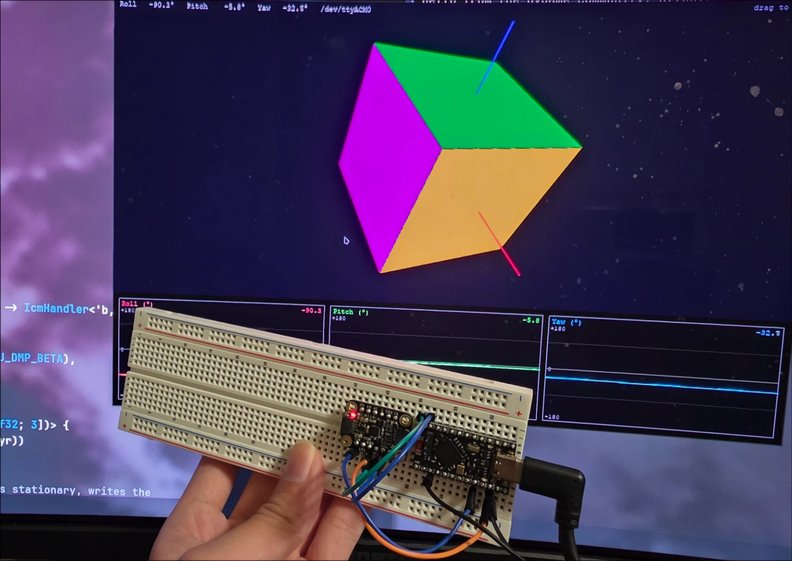

# Simple coprocessor for ICM 20948

Reads w/ 6dof from the ICM 20948 at 1kHz, running madgwick fusion, replacing the need for the proprietary MPU/ICM DMP software. Targets the nrf52840 w/ adafruit uf2 bootloader. Outputs via UART with COBS & crc16 (the intended use case is on the camera frame for a gimbal, where the uart will run through a slip ring, so packet loss is possible).

after cobs decoding, the packet consists of 7 single-precision floats (f32), little-endian, in order of: `accel_x|accel_y|accel_z|quat_w|quat_i|quat_j|quat_k` proceeded immediately by a crc16 over the previous 28 bytes (aka all the data).

crc16 w/ poly=0x1021, init=0xFFFF (see src/comms.rs)

## visualization

in scripts there's a visualize.py program that will display the orientation in 3d (thanks claude). You will need a uart to usb adapter for it to work since i didn't implement USB communication in the firmware.

## nix flake

run `nix develop` and bazinga: you get a shell with all the required toolchains and python dependencies. A simple script `flash gimbaldmp` is available to build and copy over to a nice!nano mcu. Otherwise, copy the uf2 manually or update the script in flake.nix

## license

MIT licensed, do whatever you want with this, or use it as a base for your own gimbal project.

## why?

a. needed this for a gimbal project
b. needed excuse to write more rust

result: this!
